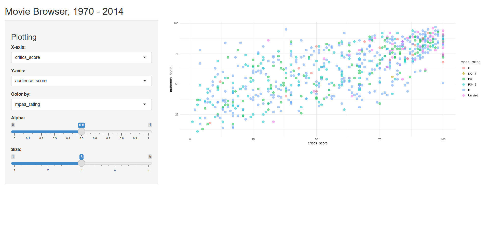

# 🎬 Movie Browser (1970–2014) | R Shiny App

An interactive **R Shiny application** that allows users to explore relationships between
**critics scores**, **audience scores**, and **MPAA ratings** for movies released between **1970 and 2014**.

This project is designed for learning **data visualization**, **Shiny UI controls**, and
**exploratory data analysis**.

---

## 📊 App Features

- Select **X-axis** and **Y-axis** variables dynamically
- Color points by **MPAA rating**
- Adjust:
  - Point **transparency (alpha)**
  - Point **size**
- Interactive scatter plot using **ggplot2**

---

## 🖼 App Preview



---

## 🛠 Technologies Used

- R
- Shiny
- ggplot2
- dplyr

---

## 📂 Dataset

- `movies.csv`
- Contains movie ratings, critics scores, audience scores, and MPAA classifications

---

## ▶️ How to Run the App

1. **Install required packages**. Open R or RStudio and run:

```r
install.packages(c("shiny", "ggplot2", "dplyr"))

2. **Launch the Shiny app:**

library(shiny)
runApp("path/to/your/app")

3. **Open your browser and explore the interactive plots.**
